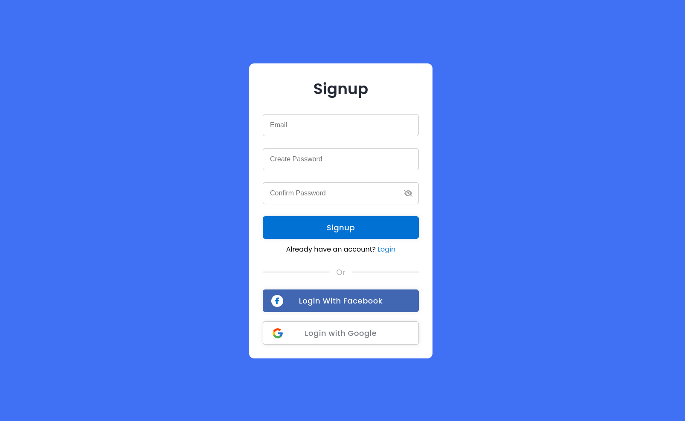

# SignUp Form

Signup/login form with google OAuth 2.0 and facebook login.

## [Live Preview](https://login-and-signup-form-in-expressjs.onrender.com/)



## Features

- Create new account.
- Login with existing account.
- Login in with google account.
- Login in with facebook account.
- Secure login and signup functionality with session-based authentication.
- Efficiently creating and deleting user sessions, automatically handling session expiration.
- Ensuring user passwords are stored securely using hashing techniques.

## Tech Stack

- Html
- Typescript
- Scss
- Express
- EJS

## Environment Variables

To configure the application, you need to set the following environment variables in your `.env` file:

- `MONGODB_URI`: Your MongoDB connection string.
- `HOST`: The host address where your application will run.
- `PORT`: The port on which your application will listen.
- `CLIENT_ID`: Your google OAuth client ID.
- `CLIENT_SECRET`: Your google OAuth Client secret.
- `REDIRECT_URI`: Your google OAuth redirect url for google callback request.

## 📦 Installation

To get started with the project, follow these steps:

1. **Clone the repository**:

   ```bash
   git clone https://github.com/MAliHassanDev/login-and-signup-form-in-expressjs.git
   cd login-and-signup-form-in-expressjs
   ```

2. **Install dependencies**:

   ```bash
   npm install
   ```

3. **Start the application**:
   ```bash
   npm run dev
   ```

## Navigation

- My next project [FullStack Ecommerce  Store](https://github.com/MAliHassanDev/ecommerceStore)
- My previous project [User Auth Vanilla Js](https://github.com/MAliHassanDev/UserAuth-Vanilla-NodeJs)
